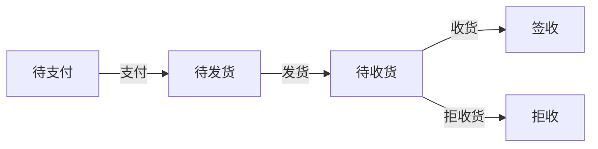

Spring 状态机使用样例
--

**版本说明:**

- JDK 1.8
- Spring Boot 2.1.17
- Spring State Machine 2.1.3

**如何运行:**

- 拉取源码 `git clone source_code`
- 运行项目 ` ./mvnw spring-boot:run`
- 订单状态变更
``` 
//创建订单
POST http://localhost:8080/order/create
{
  "orderStateCode": 1 //初始化订单状态码
}

//变更订单状态
POST http://localhost:8080/order/changeState
{
  "orderId": 1, //订单号
  "orderEventCode": 1 //订单事件码
}

```
- 查看数据
```
H2数据库地址 http://localhost:8080/h2-console
url = jdbc:h2:mem:test
username = admin
password = 123
```
**状态图:**




